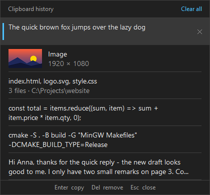

# Clipboard History

A small Windows tray tool that remembers the last 50 things you copied — texts, files and images.
Pressing **Ctrl+V** opens a list of them instead of pasting right away, so you can pick an older
entry — or just hit Enter to paste the latest one as usual.



- Small native Win32 executable (C++20), no installer, no frameworks
- The popup never takes focus, so the application you paste into keeps its caret and selection
- History is kept encrypted, in memory as well as on disk
- Follows the Windows light/dark theme and is per-monitor DPI aware

## Usage

Start `clipboard_history.exe`. It lives in the notification area (tray) and records the texts,
files and images you copy.

### The popup

Press **Ctrl+V** in any application. The list opens at the text caret (or centred on the screen if
the application doesn't expose one) with the most recent entry selected.

| Input                         | Action                                   |
|-------------------------------|------------------------------------------|
| `Enter` or `Ctrl+V` again     | Paste the selected entry                 |
| `Up` / `Down`                 | Select another entry                     |
| `PgUp` / `PgDn`, `Home`/`End` | Move faster through the list             |
| Mouse click on an entry       | Paste that entry                         |
| `Delete`, or click the **✕**  | Remove the selected entry                |
| **Clear all** (header)        | Remove all entries                       |
| `Esc`, any other key, click outside | Close the popup                    |

A pasted entry moves to the top of the list. Removing the top entry (or clearing the list) also
removes that content from the Windows clipboard, so a deleted item is really gone.

Besides text, the list shows

- **files and folders** copied in Explorer (or any other program that puts files on the clipboard),
  with their names and folder. Only the paths are remembered, not the file contents: pasting copies
  the files as they are at that moment, and files that no longer exist are left out. Files that
  were *cut* are pasted as a copy, too.
- **images** (screenshots, *Copy image* in a browser, a selection in a paint program, …) with a
  thumbnail and their size in pixels.

Text is pasted as plain text. If a program puts several formats on the clipboard, files win over
text and text wins over an image — so cells copied from a spreadsheet are recorded as text, not as
the picture of them that the spreadsheet adds.

### Tray icon

- **Left click** – open the list in copy-only mode (the chosen entry is put on the clipboard, not
  pasted)
- **Right click** – menu:
  - **Open history**
  - **Pause (Ctrl+V pastes normally)** – stops recording and leaves Ctrl+V alone; useful in
    programs where Ctrl+V means something other than paste
  - **Start with Windows** – adds/removes an entry under
    `HKCU\Software\Microsoft\Windows\CurrentVersion\Run`
  - **Show image thumbnails** – on by default; switch it off to list images by their size only,
    e.g. when other people can see your screen
  - **Clear history**
  - **Exit**

### When Ctrl+V pastes normally

The list is skipped and Ctrl+V behaves as usual when

- the clipboard holds something the tool does not record (neither text, files nor an image; an
  image of more than 64 MB; more than 256K characters of text),
- the clipboard content was marked as secret by a password manager
  (`ExcludeClipboardContentFromMonitorProcessing` / `CanIncludeInClipboardHistory`) — such content
  is never recorded,
- the history is empty or the tool is paused,
- the focused window belongs to a program running as administrator (Windows hides its key presses
  from non-elevated tools). Run the tool elevated if you need the list there.

`Ctrl+Shift+V` and `Shift+Insert` are never intercepted.

### Storage

The history is saved to `%APPDATA%\ClipboardHistory\history.dat`. The file is encrypted with the
Windows Data Protection API (DPAPI), which ties it to your Windows user account: no password to
manage, and the file is unreadable for other users or when copied to another machine.

Texts and file lists are saved, each up to 256K characters. **Images are kept in memory only** and
are gone after a restart of the tool: a single one may take up to 64 MB (uncompressed, which is
how Windows hands them out — a 4K screenshot is about 33 MB), all of them together up to 256 MB;
beyond that the oldest images are dropped. The list holds at most 50 entries.

While the tool runs, the entries are not kept as plain data in memory either: every text, file
list, image and thumbnail is encrypted with `CryptProtectMemory` and only decrypted for the moment
it is drawn, pasted or saved, after which the plain copy is wiped. The key is held by the Windows
kernel, so reading the process memory, a crash dump, the pagefile or the hibernation file yields
only ciphertext.

This raises the bar, it is not a sandbox: Windows gives every program in your session access to
the *current* clipboard content, and a malicious program running under your account could also
inject code into the tool. Against other users and against someone who gets hold of the disk or
the file, the history is safe.

## No Microsoft account needed

The tool works entirely offline and with a plain local Windows account. There is no sign-in, no
cloud sync and no telemetry — it contains no networking code at all, and links against nothing but
the basic Windows system libraries (`user32`, `gdi32`, `shell32`, `advapi32`, `crypt32`, `dwmapi`,
`uxtheme`, `shcore`). What you copy never leaves the machine.

### Compared to Windows' built-in clipboard history (Win+V)

Windows 10 and 11 ship their own clipboard history. Its local list also works with a local
account, but everything beyond that is built around a Microsoft account, and it forgets the list
on every restart:

|                          | This tool                                   | Windows clipboard history (Win+V)                          |
|--------------------------|---------------------------------------------|------------------------------------------------------------|
| Microsoft account        | Never used                                  | Not needed for the local list; *Sync across devices* requires a Microsoft (or work) account |
| Where the data goes      | Stays on the machine, no networking code    | Local only while sync is off; with sync on, copied text is uploaded to Microsoft's cloud |
| After a restart          | Texts and files are still there (encrypted on disk), images are not | List is cleared, except for pinned items |
| Entries                  | 50                                          | 25                                                         |
| Content                  | Text, files and images (up to 64 MB each)   | Text, HTML and images (up to 4 MB each); no files          |
| Pinning entries          | No                                          | Yes                                                        |
| Shortcut                 | **Ctrl+V** – the key you already press      | **Win+V**, a separate shortcut next to the normal paste    |
| Setup                    | Start the exe                               | Enable under *Settings → System → Clipboard*               |

So if all you want is a local list, Win+V does not force you into a Microsoft account either — the
difference is that this tool has no account-bound features to begin with, keeps the history across
restarts, and sits on the normal paste shortcut.

- It does not use or depend on the Windows clipboard history or its sync feature. Both can stay
  switched off under *Settings → System → Clipboard*; the two can also run side by side, since
  they use different shortcuts.
- The encryption of the history file (DPAPI) is tied to your Windows user profile, not to an online
  account, so it works the same for local, Microsoft and domain accounts.
- One thing to know with local accounts: if an administrator *resets* your password (as opposed to
  you changing it yourself), Windows can no longer decrypt DPAPI-protected data, and the saved
  history is lost. The tool then simply starts with an empty list.

## Building

Requirements: Windows 10 or later, CMake, and a C++20 compiler (MinGW-w64 or MSVC).

### CLion

Open the folder and build/run the `clipboard_history` target.

### Command line

With `cmake` and a MinGW-w64 `bin` folder (`g++`, `mingw32-make`) on the `PATH`:

```powershell
cmake -S . -B build -G "MinGW Makefiles" -DCMAKE_BUILD_TYPE=Release
cmake --build build
```

The executable ends up in `build\clipboard_history.exe`.

If you have Ninja on the `PATH` as well, `-G Ninja` works the same way and builds a little faster.
Without it, `-G Ninja` fails with *"unable to find a build program corresponding to Ninja"* — use
the MinGW Makefiles generator above instead. With MSVC, run the commands from a *Developer
PowerShell for VS* and leave out `-G` to get the default Visual Studio generator (the exe then
lands in `build\Release\`, and `--config Release` goes on the build command instead of
`CMAKE_BUILD_TYPE`).

`CMakeLists.txt` asks for CMake 4.3 because that is what CLion generated; nothing in it needs a
recent version, so lower `cmake_minimum_required` if your CMake is older.

#### Using CLion's bundled toolchain

No separate compiler is needed if CLion is installed: it ships MinGW, Ninja and CMake. Put them on
the `PATH` for the current session (adjust the version in the path) and build as above:

```powershell
$clion = "C:\Program Files\JetBrains\CLion 2025.3.3\bin"
$env:PATH = "$clion\mingw\bin;$clion\ninja\win\x64;$clion\cmake\win\x64\bin;$env:PATH"
cmake -S . -B build -G Ninja -DCMAKE_BUILD_TYPE=Release
cmake --build build
```

A standalone CMake install works just as well with CLion's MinGW; only the compiler has to come
from that folder.

### Note on MinGW builds

The executable is linked statically (`-static`), so `clipboard_history.exe` is a single standalone
file: it needs no MinGW runtime DLLs and only imports libraries that ship with Windows. Copy it
wherever you like.

CLion's bundled MinGW needs two linker fixups for that, because its static `libwinpthread` was
built against UCRT while the toolchain defaults to `msvcrt`. `CMakeLists.txt` probes for this at
configure time (`STATIC_LINK_WORKS` / `STATIC_LINK_WORKS_WITH_FIXUPS`) and only adds the fixups
where a plain `-static` link fails, so other MinGW-w64 distributions (MSYS2, WinLibs, llvm-mingw)
are not affected. If neither variant links, CMake prints a warning and falls back to a build that
needs `libwinpthread-1.dll` next to the exe.

To check the result: `objdump -p build\clipboard_history.exe | findstr "DLL Name"` should list
only Windows system DLLs.

## Project layout

| File             | Purpose                                                        |
|------------------|----------------------------------------------------------------|
| `main.cpp`       | The whole application                                          |
| `app.manifest`   | Common-controls v6 and per-monitor DPI awareness               |
| `app.rc`         | Embeds the manifest for MinGW builds (MSVC embeds it directly) |
| `CMakeLists.txt` | Build script                                                   |
